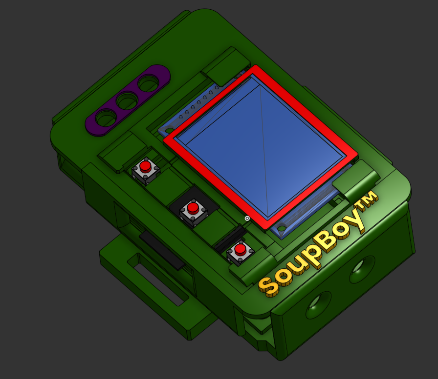

<div align="center">

# 🍜 SoupBoy


<p>
  
</p>

### ✨ _A pipboy-like watch that's gonna be the handiest gadget when you start falling out._ ✨

</div>

---

## 🧭 Overview

The world is falling out, and while everyone else is panicking, we're building the **ultimate survival companion** for the souptastic wasteland.

Introducing ***SOUP BOY*** — your wrist-mounted companion for navigating the chaos of the post-fallout world. Real-time GPS, WiFi scanning, IR copying, and a cozy retro UI that'll keep you sane when everything else is falling apart.

> _"When the world ENDSSS, at least you'll have SoupBoy."_

Built with ❤️ by the **Hardware Pirates** — destined to steal your *golden koi* when civilization crumbles.

---


## 🌟 Features

When the world is ending, you need these features to survive:

| Feature | Description |
|---------|-------------|
| 🗺️ **GPS Location** | Know exactly where you are when everything else is lost |
| 📡 **RF Jammer** | Jamming Bluetooth with NRF24 |
| 📶 **Passive WiFi Scan** | See nearby networks for intel gathering |
| 🍕 **WiFi Names** | Broadcast funny SSIDs to confuse the wastelanders |
| 🔦 **IR Tool** | Copy remote codes (receive-only for now) |
| 🎨 **SoupBoy UI** | Cozy retro UI with wrist-rotated display, avatar, and tabs |

---

## 🔧 Hardware Stack

| Subsystem | Component | Description |
|-----------|-----------|-------------|
| **🧠 MCU** | ESP32-S3-DevKitC-1 | 16MB Flash, 8MB PSRAM, Xtensa LX7 dual-core |
| **📡 RF** | nRF24L01+ | 2.4GHz radio — TX disabled in firmware |
| **🗺️ GPS** | NEO-6M | UART navigation for finding your way |
| **🖥️ Display** | 128x160 OLED 1.8" | SPI interface, wrist-rotated |
| **🔦 IR** | 3-pin IR Trans-Receiver | Remote code copying and emitting |

---

## 🛠️ Hardware Design

### Schematic

📄 *For a detailed overview, check the [PDF](schematic.pdf)*


---

## 💾 Firmware

The firmware is an Arduino-style ESP32-S3 sketch in [`firmware/`](firmware/). It builds a polished hackathon-prototype UI with:

- 🚀 Boot animation with SoupBoy OS branding
- 📱 Wrist-rotated 160x128 display layout
- 🧭 Top navigation tabs: **TOOLS**, **DEVICE**, **RF**
- 🎮 Navbar navigation: left/right switches tabs, select enters submenu
- 🔄 Submenu navigation: left/right cycles features, select activates
- 👤 Soup avatar generated from `soup-avatar.png`
- 📍 Working pages for GPS, IR Tool, Battery, Status, System Info, Avatar, About
- 📶 Passive WiFi scanning + funny SSID name broadcaster
- 🔒 nRF transmit actions disabled (safe mode)
- 🧪 GPS and RF pages fail gracefully when modules offline

> ⚡ No temperature or weather-station features are implemented (yet).

---

## 📍 Pin Map

All pins are centralized in [`firmware/include/pins.h`](firmware/include/pins.h).

| Function | ESP32-S3 Pin |
|----------|--------------|
| Display RST | GPIO8 |
| Display CS | GPIO9 |
| Display DC | GPIO10 |
| Display SDA/MOSI | GPIO11 |
| Display SCL/SCK | GPIO12 |
| Button Left | GPIO6 |
| Button Middle / Select (hold = Navbar) | GPIO42 |
| Button Right | GPIO5 |
| Battery Divider | GPIO2 |
| GPS RX | GPIO16 |
| GPS TX | GPIO17 |
| GPS PPS | GPIO13 |
| IR OUT | GPIO35 |
| IR VCC | GPIO36 |
| IR GND | GPIO37 |
| LED1 | GPIO15 |
| LED2 | GPIO18 |
| LED3 | GPIO21 |

> ℹ️ nRF24L01+ CE/CSN/MISO pins are reserved/unknown, so TX remains disabled.

**Button Input:** Uses a 70ms debounce window and a 220ms repeat guard to prevent accidental multiple presses.

---

## 🏗️ Build & Upload

### Arduino IDE

1. Open [`firmware/firmware.ino`](firmware/firmware.ino)
2. Select **ESP32-S3 DevKitC** board
3. Install required libraries:
   - `Adafruit GFX Library`
   - `Adafruit ST7735 and ST7789 Library`
   - `TinyGPSPlus`
   - `IRremote` (for IR tool)
   - `RF24` (for nRF24)
4. Compile and upload 🚀

### PlatformIO

```bash
pio run
pio run --target upload
